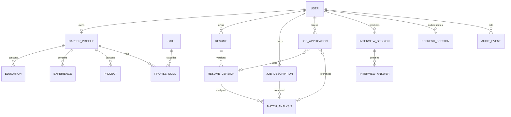
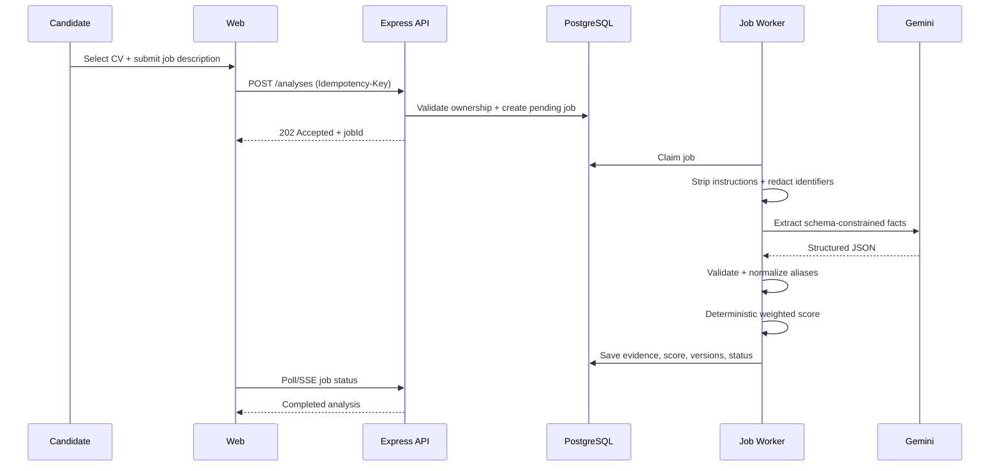

# CareerPilot — Professional System Architecture

## 1. Architectural style

Start as a **modular monolith** with separately deployed frontend and backend applications. This keeps operational complexity low while preserving clear bounded modules. Extract a service only after profiling proves a scaling, reliability, or ownership need.

The repository is organized into distinct top-level **`frontend/`** and **`backend/`** directories, alongside shared **`packages/`**:

- `frontend/web`: Candidate Next.js App Router frontend.
- `frontend/admin`: Separately built Next.js admin frontend and stricter access policy.
- `backend/api`: Express REST API; the only component allowed to access PostgreSQL, Gemini, storage, and server secrets.
- `backend/worker`: Dedicated background worker process for queued AI and document export jobs.
- `packages/*`: Shared, framework-agnostic libraries (`contracts`, `design-system`, `scoring`, `config`).

## 2. Context diagram

```mermaid
flowchart LR
  U[Candidate] --> W[Next.js Candidate App (frontend/web)]
  A[Administrator] --> AD[Next.js Admin App (frontend/admin)]
  W -->|HTTPS REST| API[Express API (backend/api)]
  AD -->|HTTPS REST| API
  API --> PG[(PostgreSQL)]
  API --> OBJ[(Private Object Storage)]
  API --> Q[(Job Queue)]
  Q --> WK[Worker Process (backend/worker)]
  WK --> GEM[Gemini API]
  WK --> PDF[Playwright PDF]
  WK --> DOCX[DOCX Generator]
  WK --> PG
  WK --> OBJ
```

For the smallest MVP, a PostgreSQL-backed job table can provide queue semantics. Add Redis/BullMQ only when concurrency and retry measurements justify it.

## 3. Deployment boundaries

```mermaid
flowchart TB
  subgraph Public
    CDN[CDN / WAF]
  end
  subgraph Frontend
    WEB[Candidate Next.js (frontend/web)]
    ADM[Admin Next.js (frontend/admin)]
  end
  subgraph Private Backend Network
    API1[Express API Replica (backend/api)]
    WORKER[Background Worker (backend/worker)]
    DB[(Managed PostgreSQL)]
  end
  subgraph External
    STORE[Private Object Storage]
    AI[Gemini API]
    MAIL[Transactional Email]
  end
  CDN --> WEB
  CDN --> ADM
  WEB --> API1
  ADM --> API1
  API1 --> DB
  API1 --> STORE
  API1 --> MAIL
  WORKER --> DB
  WORKER --> STORE
  WORKER --> AI
```

Only the API is trusted to make authorization decisions. Next.js middleware improves UX but is not a security boundary.

## 4. Repository architecture

The repository structure cleanly separates **Frontend**, **Backend**, and **Shared Packages**:

```text
careerpilot/
├── frontend/                    # All client-facing and web applications
│   ├── web/                     # Candidate Next.js App Router application
│   │   ├── app/
│   │   │   ├── (marketing)/     # Landing page and public flows
│   │   │   ├── (auth)/          # Candidate login & registration
│   │   │   ├── (workspace)/     # Protected candidate suite
│   │   │   │   ├── profile/     # Career profile and verified skills
│   │   │   │   ├── resumes/     # Resume builder and ATS export
│   │   │   │   ├── analyze/     # Job description & deterministic match analysis
│   │   │   │   ├── applications/# Pipeline tracker & Kanban board
│   │   │   │   ├── writing/     # AI Writing Studio (XYZ bullets & cover letters)
│   │   │   │   ├── interviews/  # Mock Interview prep & STAR rubric evaluation
│   │   │   │   └── settings/    # Notifications, locale (EN/BN), support access
│   │   │   └── api/             # Optional same-origin BFF/proxy
│   │   ├── package.json
│   │   └── tsconfig.json
│   │
│   └── admin/                   # Administrative & Compliance Next.js application
│       ├── app/
│       │   ├── login/           # Admin authentication with strict controls
│       │   └── (console)/       # Protected admin management suite
│       │       ├── overview/    # System health & metric monitors
│       │       ├── users/       # User management
│       │       ├── templates/   # Resume ATS template manager
│       │       ├── scoring/     # Deterministic scoring rule configuration
│       │       ├── operations/  # AI token, cost, and rate-limit tracking
│       │       ├── support/     # Time-bound candidate support access verification
│       │       └── audit/       # Security & access audit log stream
│       ├── package.json
│       └── tsconfig.json
│
├── backend/                     # All server-side applications and services
│   ├── api/                     # Express REST API application
│   │   ├── src/
│   │   │   ├── bootstrap/       # Config validation and admin seed command
│   │   │   ├── config/          # Typed environment configuration (Zod)
│   │   │   ├── core/            # Errors, logger, HTTP, auth primitives
│   │   │   ├── middleware/      # Request ID, auth, CSRF, validation, limits
│   │   │   ├── modules/
│   │   │   │   ├── auth/        # Argon2id, JWT access, refresh token family
│   │   │   │   ├── profiles/    # Career profile, education, experience, projects
│   │   │   │   ├── resumes/     # Resumes, immutable snapshot versioning
│   │   │   │   ├── jobs/        # Job descriptions, PII redaction, extraction
│   │   │   │   ├── matching/    # Deterministic scoring, evidence map
│   │   │   │   ├── applications/# Application pipeline, metrics, reminders
│   │   │   │   ├── writing/     # Quota tracking, bullet improver, cover letters
│   │   │   │   ├── interview/   # Mock interview sessions, STAR rubric evaluation
│   │   │   │   ├── notifications/# Candidate notification & locale preferences
│   │   │   │   ├── support/     # Temporary support-access grant & verification
│   │   │   │   ├── exports/     # ATS HTML templates, DOCX, network-isolated PDF
│   │   │   │   └── ai/          # Gemini adapters, PII redaction, prompts
│   │   │   ├── jobs/            # Queue producers and in-process dispatchers
│   │   │   ├── app.ts           # Express application routing and middleware setup
│   │   │   └── server.ts        # HTTP listener and graceful shutdown
│   │   ├── prisma/
│   │   │   └── schema.prisma    # PostgreSQL domain schema and migrations
│   │   ├── test/                # Hermetic integration and unit tests
│   │   ├── package.json
│   │   └── tsconfig.json
│   │
│   └── worker/                  # Background worker process
│       ├── src/
│       │   ├── handlers/        # Async queue handlers (AI extraction, export jobs)
│       │   └── index.ts         # Worker process entrypoint
│       ├── package.json
│       └── tsconfig.json
│
└── packages/                    # Shared internal workspace packages
    ├── contracts/               # Shared DTOs, Zod schemas, API contracts, i18n
    ├── design-system/           # UI tokens (Pine/Ink/Canvas), typography, theme
    ├── scoring/                 # Pure, deterministic TS matching engine & dictionary
    └── config/                  # Base TypeScript & toolchain configurations

### Workspace Folder Organization

The repository has been transitioned to the dedicated `frontend/` and `backend/` top-level structure:

| Workspace Location | Role / Package Name | Purpose |
| :--- | :--- | :--- |
| `frontend/web` | `@careerpilot/web` | Candidate Next.js application |
| `frontend/admin` | `@careerpilot/admin` | Admin console Next.js application |
| `backend/api` | `@careerpilot/api` | Express REST API & Prisma data layer |
| `backend/worker` | `backend/worker` | Background job queue processor process |
| `packages/contracts` | `@careerpilot/contracts` | Shared schemas, API contracts, i18n |
| `packages/design-system` | `@careerpilot/design-system` | Shared UI tokens and theme |
| `packages/scoring` | `@careerpilot/scoring` | Deterministic CV matching engine |
| `packages/config` | `@careerpilot/config` | Shared TypeScript configuration |

## 5. Backend layering

Each module uses:

```text
route → authentication/authorization → DTO validation → controller
      → application service → repository/adapter → database/provider
```

Rules:

- Controllers map HTTP only.
- Services own use cases and transactions.
- Repositories encapsulate Prisma queries and mandatory ownership filters.
- Provider adapters isolate Gemini, email, object storage, PDF, and DOCX.
- Domain/scoring functions are pure and extensively unit tested.
- No direct Prisma or Gemini calls from routes/controllers.

## 6. API conventions

- Base path: `/api/v1`.
- JSON uses camelCase; timestamps are ISO 8601 UTC.
- Standard error envelope:

```json
{
  "error": {
    "code": "VALIDATION_ERROR",
    "message": "Review the highlighted fields.",
    "fieldErrors": {},
    "requestId": "req_..."
  }
}
```

- Cursor pagination for activity and large tables.
- Idempotency key required for analysis, export, and other retryable creation endpoints.
- Optimistic concurrency (`version` or `updatedAt`) prevents lost edits.
- OpenAPI is source-controlled; shared frontend types are generated, not manually duplicated.

## 7. Core data model



Key decisions:

- `ResumeVersion.contentSnapshot` is immutable JSONB.
- `MatchAnalysis` stores normalized inputs, category outputs, algorithm version, AI prompt version, and timestamps.
- Refresh tokens are never stored plaintext; store token-family ID and token hash.
- Soft delete only where recovery/legal requirements justify it; otherwise explicit cascades and deletion jobs.
- Multi-tenant ownership is enforced in every query using authenticated `userId`.

## 8. Match-analysis pipeline



### Scoring package contract

```ts
type MatchInput = {
  resume: NormalizedResumeEvidence;
  job: NormalizedJobRequirements;
  rules: ScoringRuleSet;
};

type MatchResult = {
  score: number;
  categories: Record<string, number>;
  matchedEvidence: Evidence[];
  missingRequirements: Requirement[];
  scoringVersion: string;
};
```

The package receives no network/database dependency. Golden fixtures guarantee repeatability.

## 9. Export architecture

1. API creates an export job referencing an immutable resume version.
2. Worker renders an internal, authenticated HTML document.
3. Browser process has outbound network blocked; assets are allowlisted or embedded.
4. PDF is created with Playwright/Puppeteer; DOCX is generated from the same semantic document model.
5. Output is malware-scanned where supported, stored privately, and returned by a short-lived signed URL.
6. Temporary files and browser contexts are destroyed after each job.

## 10. Admin authentication architecture

- Bootstrap command reads `ADMIN_BOOTSTRAP_EMAIL` and `ADMIN_BOOTSTRAP_PASSWORD` only on the server.
- It creates/updates no account if an administrator already exists unless an explicit rotation command is run.
- Login uses the normal identity store with stricter admin controls: MFA, shorter session, step-up authentication, IP/risk monitoring, no persistent browser token.
- Admin routes require both `ADMIN` role and permission scope; sensitive operations are audited.
- Candidate and admin cookies have different names/audiences, preventing token confusion.

## 11. Reliability and observability

- `/live` and `/ready` health endpoints; readiness checks critical dependencies without leaking details.
- Structured logs: timestamp, level, service, environment, request ID, route template, status, latency; no CV/JD text, password, token, cookie, or API key.
- Metrics: API latency/error rate, DB pool, queue depth/age, AI duration/failures, export failures, auth failures, rate-limit blocks.
- Trace IDs propagate through API and worker jobs.
- Exponential backoff with jitter only for transient provider errors; dead-letter state after bounded retries.
- Graceful shutdown stops accepting traffic, completes bounded requests/jobs, and closes Prisma/browser resources.

## 12. Environments and CI/CD

- Separate development, preview/staging, and production projects/databases/secrets.
- CI: format, lint, TypeScript, unit, integration, migration check, dependency and secret scans, SAST, build, and end-to-end smoke tests.
- Migrations run as a controlled release job; application instances do not auto-run destructive migrations on boot.
- Backward-compatible expand/migrate/contract database changes.
- Infrastructure configuration and security headers are version-controlled.
